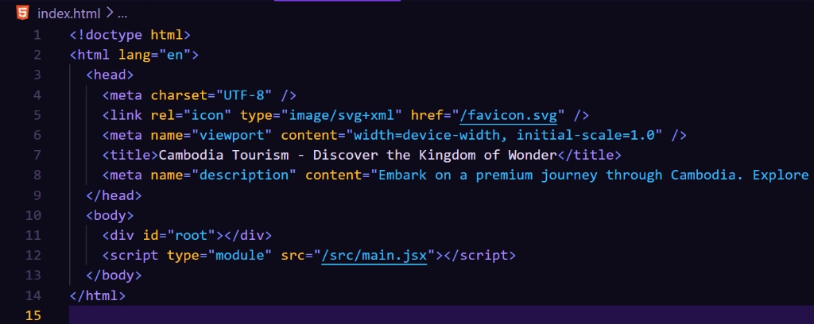
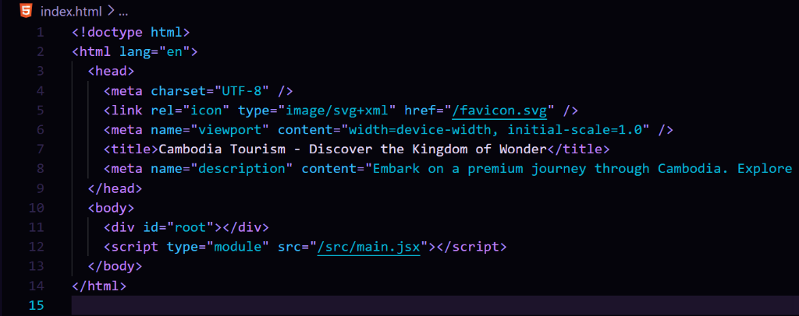
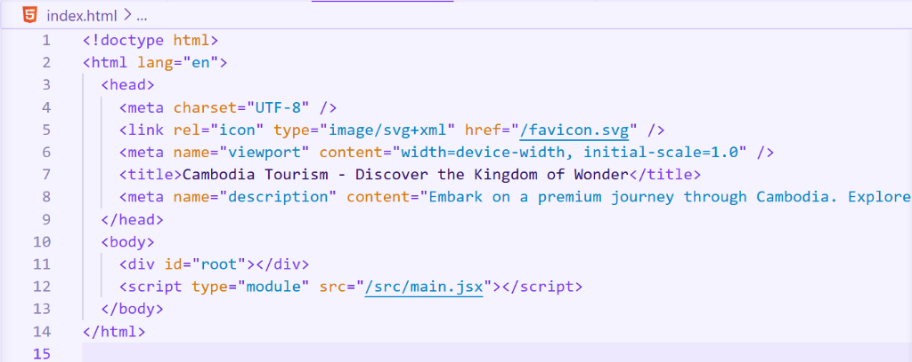
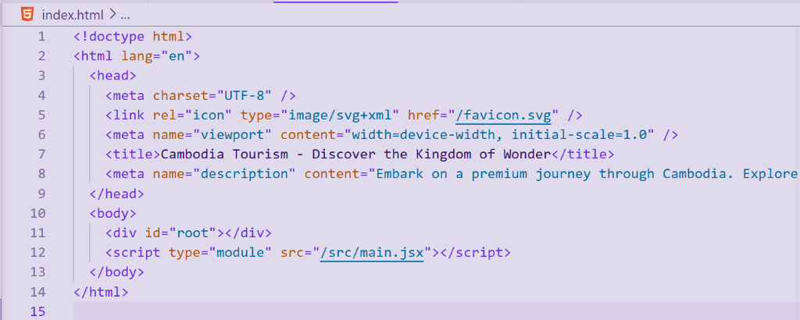

# Shadow Monarch (Solo Leveling Theme)

*“Arise.”*

Bring the power of the Shadow Monarch directly into your workspace. Inspired by **Sung Jin-woo** and the iconic UI of *Solo Leveling*, this extension contains **four premium theme variants** designed for maximum focus, comfort, and visual hierarchy.

---

## 🌌 The Variants

Each variant is tuned for a different coding environment and lighting condition, utilizing the distinct color palette of the Solo Leveling System.

### 🔮 Shadow Monarch (Void — Default Dark)
The signature look. Designed for daily coding, **Void** places your code against a deep, purple-toned black background. High-readability syntax highlighting maps electric purple to keywords, radiant gold to functions, and glowing cyan to strings, mimicking the holographic System status window.

* **Editor Background**: `#0D0A1A` (Deep void black)
* **Best Suited For**: Day-to-day coding in standard lighting.

### 💀 Shadow Monarch Abyss (Ultra Dark)
For when you descend into the deepest dungeons. **Abyss** darkens the canvas to an absolute pitch-black background. By stripping away background luminance, it makes the neon cyan strings and electric purple keywords glow like active shadow-soldier extraction magic.

* **Editor Background**: `#05040B` (Absolute abyssal black)
* **Best Suited For**: Night coding sessions and high-contrast preferences.

### 🌸 Shadow Monarch Light (Pastel Light)
A light-mode counterpart styled in the lavender family. **Light** provides a clean, soft pastel lavender-white workspace. It features high-contrast indigo, deep violet, warm gold, and emerald green syntax colors that make reading code easy on the eyes in bright rooms.

* **Editor Background**: `#F5F3FF` (Soft lavender-white)
* **Best Suited For**: Working in bright rooms or outdoors.

### 🌆 Shadow Monarch Twilight (Twilight Gray)
A low-strain, mid-contrast light theme. **Twilight** uses a dusty lavender-gray background that eliminates harsh blue-light reflections. It offers a relaxed, lower-contrast alternative for users who want the clarity of a light theme without the glare.

* **Editor Background**: `#E0DBEC` (Dusty lavender-gray)
* **Best Suited For**: Daytime coding with reduced eye fatigue.

---

## Token & Syntax Color Palette (Void/Abyss Dark Models)

| Color | Hex | Syntax / Tokens | Role in Solo Leveling |
| :--- | :--- | :--- | :--- |
| **Electric Violet** | `#A78BFA` | Keywords, control flow, import/export, HTML tags. | Aura of the Shadow Monarch |
| **Radiant Gold** | `#FBBF24` | Functions, method calls, React hooks, decorators, list hovers. | Golden key / Quest systems |
| **Status Window Cyan** | `#38BDF8` | Strings, template literals, JSON values, CSS values. | Glowing holographic stat screens |
| **Blood Red** | `#F43F5E` | Numbers, booleans, constants (`true`, `false`, `null`). | Jin-woo's eyes & high-threat warnings |
| **System Green** | `#34D399` | Comments (*italic*), docstrings. | Healing potions & passive buff displays |
| **Pale Lavender** | `#E2D9F3` | Variable names, parameters, plain text, CSS selectors, operators. | Cold silver shadow energy |
| **Glowing Blue-Purple**| `#818CF8` | Punctuation, delimiters, brackets, JSX attributes. | Shadow soldier energy |

---

## Installation & Setup

To install **Shadow Monarch** manually:

### Step 1: Copy folder to Extensions directory
Copy the containing folder into the appropriate extensions folder:

* **VS Code (Standard)**:
  - **Windows**: `%USERPROFILE%\.vscode\extensions\shadow-monarch`
  - **macOS/Linux**: `~/.vscode/extensions/shadow-monarch`
  
* **VS Code Insiders**:
  - **Windows**: `%USERPROFILE%\.vscode-insiders\extensions\shadow-monarch`
  - **macOS/Linux**: `~/.vscode-insiders/extensions/shadow-monarch`

### Step 2: Reload window
Open the Command Palette (`Ctrl+Shift+P` or `Cmd+Shift+P`) in VS Code, run **Developer: Reload Window**, and press **Enter**.

### Step 3: Activate theme
Press **`Ctrl+K` then `Ctrl+T`** (or go to **Preferences: Color Theme** via the Gear icon), search for **Shadow Monarch**, and select any of the 4 variations!
